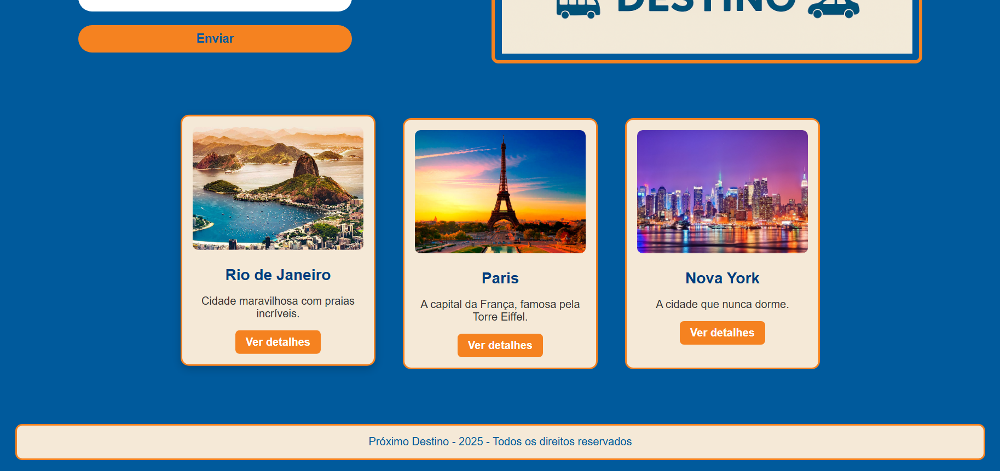
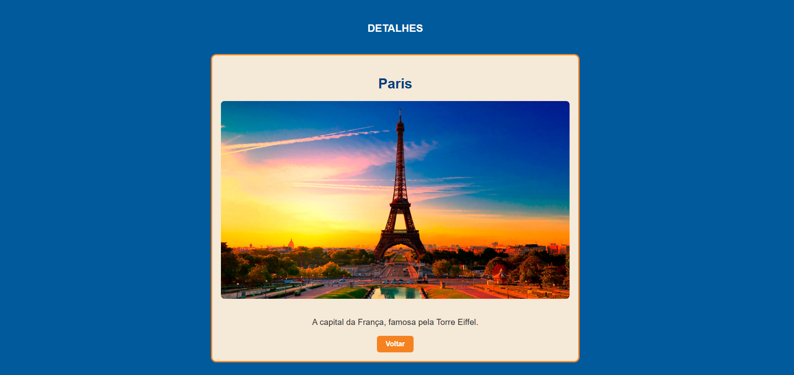

[](https://classroom.github.com/a/KZhXwLZL)
[](https://classroom.github.com/open-in-codespaces?assignment_repo_id=20649945)
# Trabalho Prático 05 - Semanas 7 e 8

## Informações Gerais

- Nome: Brendon Guilherme Castro
- Matricula: 897493
- Proposta de projeto escolhida: Site de Viagens - Próximo Destino
- Breve descrição sobre seu projeto: Site com ideias de lugares para viajar, com fotos e breve descrição dos lugares indicados.

## Print da Home-Page




## Print da página de detalhes do item





## Cole aqui abaixo a estrutura JSON utilizada no app.js

```javascript
[
  {
    "id": 1,
    "titulo": "Rio de Janeiro",
    "descricao": "Cidade maravilhosa com praias incríveis.",
    "imagem": "./img/rio.jpg"
  },
  {
    "id": 2,
    "titulo": "Paris",
    "descricao": "A capital da França, famosa pela Torre Eiffel.",
    "imagem": "./img/paris.jpg"
  },
  {
    "id": 3,
    "titulo": "Nova York",
    "descricao": "A cidade que nunca dorme.",
    "imagem": "./img/ny.jpg"
  }
]
```